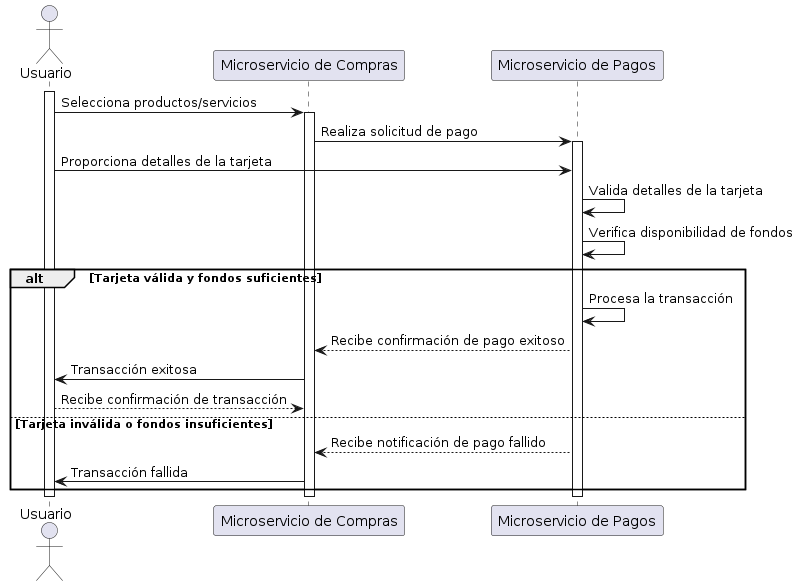

# Caso de uso: Compra y transacciones en línea con tarjeta de crédito

## Descripción
El siguiente caso de uso describe el proceso de compra y transacciones en línea utilizando una tarjeta de crédito. El objetivo es proporcionar una visión general de las interacciones y los pasos involucrados en este proceso por medio de la implementación de un flujo básico, que consiste en realizar transacciones de compra en línea utilizando una tarjeta de crédito. Sin embargo, por cuestiones prácticas y que no son de interés, se ignorarán ciertos aspectos a considerar en un sistema real como: seguridad,  el encriptado de los datos de la tarjeta, la autenticación del titular de la tarjeta y la prevención de fraudes.

### Objetivo general
Implementar dos microservicios con sus respectivas responsabilidades aplicando el paradigma funcional que ofrece Java, en complemento con el paradigma reactivo que se puede aprovechar de un framework como Quarkus para pulir habilidades ténicas y contribuir a la experiencia del desarrollador.

### Elementos/Entidades a considerar:
- Usuario: Persona que realiza la compra en línea.
- Producto: Bien o servicio que desea adquirer el usuario.
- Tarjeta: Medio para poder ejecutar la transacción de pago de una compra.
- Solicitud: Donde se detalla aspectos de la compra.
- Transacción: Resultado exitoso o fallido a raíz de procesar una solicitud.
- Microservicio de compras: Encargado de procesar las operaciones referente a las solicitudes de compras.
- Microservicio de Pagos: Encargado de procesar las operaciones referente a proveer el resultado de una transacción al recibir una solicitud.
- Sistema de Pago: Conformado por el microservicio de compras y el microservicio de pagos.

## Tecnologías a utilizar
- Lenguaje de programación: Java 17
- Framework relacionado: Quarkus v3.0
- Paradigma: Funcional y reactivo
- Persistencia de datos: MongoDB

## Flujo del caso de uso
1. El Usuario selecciona los productos o servicios que desea comprar en el sitio web de comercio electrónico.
2. El Usuario procede a realizar el pago y elige la opción de pago con tarjeta de crédito.
3. El Sistema de Pago solicita al Usuario los detalles de la tarjeta de crédito, como el número de tarjeta, fecha de vencimiento y código de seguridad.
4. El Usuario ingresa los detalles de la tarjeta de crédito y envía la solicitud de pago al Sistema de Pago.
5. El Sistema de Pago valida los detalles de la tarjeta de crédito, realiza una verificación de seguridad y verifica la disponibilidad de fondos en la cuenta asociada a la tarjeta.
6. Si los detalles de la tarjeta son válidos y hay fondos suficientes, el Sistema de Pago procesa la transacción y realiza el cargo en la tarjeta de crédito del Usuario.
7. El Sistema de Pago devuelve una respuesta al Usuario indicando si la transacción fue exitosa o no.
8. El Usuario recibe la confirmación de la transacción y el comercio electrónico actualiza el estado del pedido como "pagado".
9. En caso de que la transacción sea rechazada, el Usuario puede intentar nuevamente con otra tarjeta de crédito o cancelar la compra.
10. Fin del caso de uso.

### Diagrama de Secuencia

### Esquema de objetos

## Expectativa
El desarrollo de este workshop abarcará 10 días, en los cuales se trata de construir paso a paso el flujo del caso de uso expuesto anteriormente. Se espera que el desarrollador durante este periodo concluya la creación del mismo teniendo como punto de partida este repositorio y documentar su avance diario en ramas individuales con commits de valor y que a su vez recibirán la respectiva retroalimentación.

### Calendario

- Día 1: Creación del CRUD del microservicio de compras que permita ejecutar por medio de postman una dinámica de carrito de compras.
- Día 2: Establecer validaciones alrededor del contexto que abarca el microservicio de compras.
- Día 3: Pruebas unitarias reactivas.
- Día 4: Creación del CRUD del microservicio de pagos que permita ejecutar por medio de postman la recepción de una solicitud.
- Día 5: Establecer validaciones alrededor del contexto que abarca el microservicio de pagos.
- Día 6: Establecer comunicación entre ambos microservicios por medio de websockets.
- Día 7: Generación de transacciones de acuerdo a un resultado exitoso o fallido acorde a la solicitud recibida.
- Día 8: Pruebas unitarias reactivas.
- Día 9: Refactorización del microservicio de compras.
- Día 10: Refactorización del microservicio de pagos.

